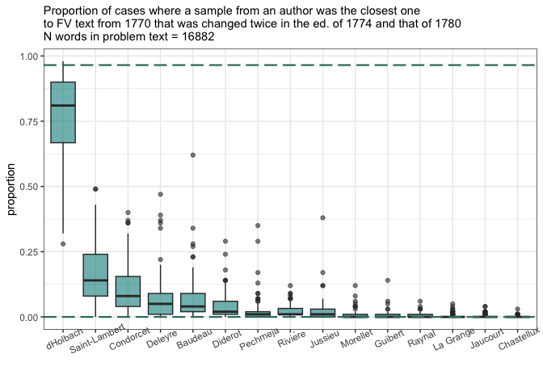

# 03_analysis

## General Impostors analysis

Some data preparation & cleaning

### load test fragments

Number of words in each test fragment

    [1] "Number of words in different editions chunks:"

    # A tibble: 7 × 2
      author                     n
      <chr>                  <int>
    1 ed1780                 86421
    2 ed1774_CH1780          18373
    3 ed1770_nch1774_CH1780  18198
    4 ed1770_CH1774_CH1780   16882
    5 ed1770_nch1774_nch1780 11841
    6 ed1770_CH1774_nch1780   5690
    7 ed1774_nch1780          4804

    [1] "Number of words in different Pensées detachées / Mélanges (pencil/ink) chunks:"

    # A tibble: 2 × 2
      author                       n
      <chr>                    <int>
    1 pencil_pensees_detachees 90200
    2 ink_melanges             70977

    [1] "Number of words in recombined likely-Diderots FV chunks:"

    # A tibble: 3 × 2
      author                 n
      <chr>              <int>
    1 fr_sauvage          9005
    2 fr_51-55-72-40      4796
    3 fr_on_russia-china  4467

### load corpus

Test corpus is the same as before in Julian’s latest tests.

### fn

Working functions

#### sample ind opt

#### diy stylo for imposters

## PART I. Editions of 1770, 1774 & 1780

Bind corpus & test fragments together.

**DATA**

The fragments were selected as follows:

-   using the metadata compiled by Julian, there are three tags for each
    fragment

    -   1770 edition: appeared / not appeared

    -   1774 edition: appeared / not appeared / changed / not changed

    -   1780 edition: appeared / changed / not changed

-   consequently, all the fragments were divided into 7 groups:

    -   appeared 1770 - not changed 1774 - not changed 1780

    -   appeared 1770 - changed 1774 - not changed 1780

    -   appeared 1770 - not changed 1774 - changed 1780

    -   appeared 1770 - changed 1774 - changed 1780

    -   appeared 1774 - not changed 1780

    -   appeared 1774 - changed 1780

    -   appeared 1780

-   based on these criteria, the fragments were combined into one text
    file which is used for the analysis below as a test text.

### imposters

#### 1770 unchanged

n words = 11841

``` r
op_list_w <- vector("list", 20)
counter <- 0

for(i in 1:20) {

  sample_independent_opt(ed_corpus %>% 
                         filter(!author %in% c("ed1770_CH1774_CH1780", 
                                               "ed1770_CH1774_nch1780", 
                                               "ed1770_nch1774_CH1780", 
                                               #"ed1770_nch1774_nch1780", 
                                               "ed1774_CH1780", 
                                               "ed1774_nch1780", 
                                               "ed1780"
                                               )),
                     sample_size = 4000,
                     text_var = "word",
                     n_samples = 2)
  
  data <- diy_stylo(folder="corpus_sampled/", 
                    mfw = 200, 
                    feature = "w",
                    n_gram = 1,
                    drop_words = T)
  
  op_list_w[[i]] <- imposters.optimize(data[-c(13, 14),])
  
  # as it takes time, it's easier to understand how long processing takes
  counter <- counter + 1
  print(counter)

}

saveRDS(op_list_w, "imp_res/0_main_res/ed1770-nch-nch_optimise_list_w.rds")
```


### fig 2a

``` r
# short plot for the article
imp_res %>%
  bind_rows() %>%  #stack all the optained prop tables into one 
  mutate(candidate = str_remove(candidate, "^/")) %>% 
  filter(candidate %in% c("Diderot", "Rivière", "Condorcet", "dHolbach", "Saint-Lambert", "Meister", "Deleyre", "Pechmeja", "Baudeau")) %>% 
  mutate(gr = ifelse(candidate == "Diderot", "d", "no")) %>% 
  ggplot(aes(x = reorder(candidate, proportion),
  y = proportion)) + 
  geom_boxplot(aes(fill = gr)) + 
  # opt lines
  geom_hline(aes(yintercept = min_mean_w),
             linewidth = 0.8,linetype = 5,color = met.brewer("Kandinsky")[1]) +
  geom_hline(aes(yintercept = max_mean_w),
             linewidth = 0.8,linetype = 5,color = met.brewer("Kandinsky")[1]) +
  
  theme_bw() + 
  coord_flip() + 
  scale_fill_manual(values = met.brewer("Kandinsky")[2:4]) + 
  labs(subtitle = "Proportion of cases where a sample from an author was the closest one\nto FV text from 1770 that stayed unchanged in later editions (1774 & 1780)", x = "Candidates (top-7 + Diderot)", y = "Proportion") +
  theme(#axis.text.x = element_text(angle = 25)
        axis.text = element_text(size = 12),
        legend.position = "None"
        )
```


``` r
ggsave("../plots_paper/fig_2-a.png",
       plot = last_plot(), dpi = 300, bg = "white",
       height = 5, width = 8)
```

This is the strongest d’Holbach authorship signal obtained from this
data, the algorithm is quite sure about his authorship for the FV
fragments of the earliest fragments (appeared ed. 1770 and remained
unchanged in later editions).

#### 1770-ch 1774-nch 1780


#### 1770-ch1774-ch1780



#### 1770-nch1774-ch1780

n words = 18 247


#### 1774-nch1780

n words = 4 821

``` r
op_list_w <- vector("list", 20)
counter <- 0

for(i in 1:20) {

  sample_independent_opt(ed_corpus %>% 
                         filter(!author %in% c("ed1770_CH1774_CH1780", 
                                               "ed1770_CH1774_nch1780", 
                                               "ed1770_nch1774_CH1780", 
                                               "ed1770_nch1774_nch1780", 
                                               "ed1774_CH1780", 
                                               #"ed1774_nch1780", 
                                               "ed1780"
                                               )),
                     sample_size = 2000,
                     text_var = "word",
                     n_samples = 2)
  
  data <- diy_stylo(folder="corpus_sampled/", 
                    mfw = 200, 
                    feature = "w",
                    n_gram = 1,
                    drop_words = T)
  
  op_list_w[[i]] <- imposters.optimize(data[-c(13, 14),])
  
  # as it takes time, it's easier to understand how long processing takes
  counter <- counter + 1
  print(counter)

}

saveRDS(op_list_w, "imp_res/0_main_res/ed1774-nch-optimise_list_w.rds")
```


#### 1774-ch1780


#### 1780

n words = 86k

``` r
op_list_w <- vector("list", 20)
counter <- 0

for(i in 1:20) {

  sample_independent_opt(ed_corpus %>% 
                         filter(!author %in% c("ed1770_CH1774_CH1780", 
                                               "ed1770_CH1774_nch1780", 
                                               "ed1770_nch1774_CH1780", 
                                               "ed1770_nch1774_nch1780", 
                                               "ed1774_CH1780", 
                                               "ed1774_nch1780"#, 
                                               #"ed1780"
                                               )),
                     sample_size = 10000,
                     text_var = "word",
                     n_samples = 2)
  
  data <- diy_stylo(folder="corpus_sampled/", 
                    mfw = 200, 
                    feature = "w",
                    n_gram = 1,
                    drop_words = T)
  
  op_list_w[[i]] <- imposters.optimize(data[-c(13, 14),])
  
  # as it takes time, it's easier to understand how long processing takes
  counter <- counter + 1
  print(counter)

}

saveRDS(op_list_w, "imp_res/0_main_res/ed1780-optimise_list_w.rds")
```


### Current conclusions

The Diderot’s authorship of these fragments is unlikely for all groups
of fragments at the moment.

D’Holbach’s signal is stronger in case of the earliest editions (1770 &
not changed later), in cases of 1770-nch-nch, 1770-ch-nch & 1774-nch
confidence interval proves that d’Holbach is the only robust and most
frequent first candidate for the authorship.

## PART II. Pensées détachées vs Mélanges

Or “pencil vs ink”.

The data is gathered using respective two columns from the metadata. All
fragments marked as included to Pensées détachées or Mélanges are
brought together in one file. These files are used for sampling and
tests. An important difference from all other tests in this case is that
both test samples here are quite large, i.e., the results might be more
robust.

### Imposters

#### Pensées détachées (pencil)


#### Mélanges (ink)


### fig 3a


### Current conclusions

It is unlikely that any of the selections (either in pencil or in ink)
are Diderot’s texts. However, our method is not sure about any of the
authors to be the candidate for the authorship.

## PART III. ‘Likely Diderot’ fragments check

Selected fragments:

-   fr_on_russia-china

-   fr_sauvage

-   fr_51-55-72-40

``` r
# select test texts from the corpus
diderot_corpus <- rbind(diderot, corpus_tokenized)

unique(diderot_corpus$author)
```

     [1] "fr_51-55-72-40"     "fr_on_russia-china" "fr_sauvage"        
     [4] "Baudeau"            "Chastellux"         "Condorcet"         
     [7] "Deleyre"            "dHolbach"           "Diderot"           
    [10] "Guibert"            "Jaucourt"           "Jussieu"           
    [13] "La Grange"          "Morellet"           "Pechmeja"          
    [16] "Raynal"             "Rivière"            "Saint-Lambert"     

``` r
# number of words in each selection
diderot_corpus %>% 
  filter(author %in% c("fr_51-55-72-40", 
                       "fr_on_russia-china", 
                       "fr_sauvage")) %>% 
  count(author)
```

    # A tibble: 3 × 2
      author                 n
      <chr>              <int>
    1 fr_51-55-72-40      4796
    2 fr_on_russia-china  4467
    3 fr_sauvage          9005

### Imposters

#### Russia-China


#### Sauvage


### fig 4a


Although Diderot is the first among the authors being the closest to the
target text, it is visible already from the boxplots, that the result on
average is pretty low (~0.4). CI confirms that the decision is far from
being final.

#### Selected fragments

# Part IV

Test the corpus without removing suscpicious authors.

## Load corpus

Load problems

## Run GI loop

### Ed corpus

Groups of fragments based on editorial history:

    [1] "ed1770_CH1774_CH1780"   "ed1770_CH1774_nch1780"  "ed1770_nch1774_CH1780" 
    [4] "ed1770_nch1774_nch1780" "ed1774_CH1780"          "ed1774_nch1780"        
    [7] "ed1780"                

### Plots

### Pencil & ink & sauvage

Pencil

Plot


Ink


Sauvage


